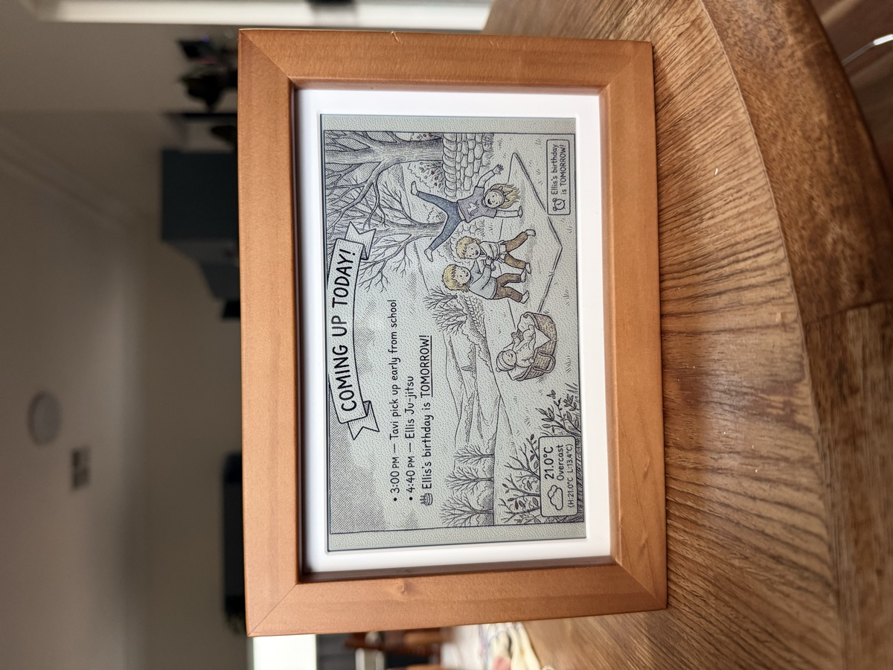

<!--
Copyright 2026 Google LLC

Licensed under the Apache License, Version 2.0 (the "License");
you may not use this file except in compliance with the License.
You may obtain a copy of the Apache License at

    http://www.apache.org/licenses/LICENSE-2.0

Unless required by applicable law or agreed to in writing, software
distributed under the License is distributed on an "AS IS" BASIS,
WITHOUT WARRANTIES OR CONDITIONS OF ANY KIND, either express or implied.
See the License for the specific language governing permissions and
limitations under the License.
-->

# Glanceboard Demo

**Glanceboard is an e-ink display that helps you start your day, built with Gemini**

This demo showcases how to use Gemini 3.6 Flash and Nano Banana to turn your Google Calendar into art on an e-ink display.

Using just a computer and an iCal feed, Glanceboard transforms your schedule, local weather, and custom family characters into Nano Banana generated art. Every morning, it reads your calendar and generates a fresh illustration so you know what's happening today, what to pack, and what to wear.

No screens. No notifications. Just a quiet picture frame that helps you know what's happening today.

**Note:** This demo was entirely vibe coded with Google Antigravity and uses off the shelf hardware.



---

## How it works

Glanceboard runs a lightweight local server on your computer (or a Raspberry Pi). Every few hours, it:

1. Reads your calendar events via iCal URL (universal standard for calendar data .ics file)
2. Fetches the current weather for your location
3. Builds a creative prompt for your characters
4. Generates an illustrated daily planner image from the above using Nano Banana
5. Dithers the image for 6-colour e-ink and serves it to your display

The display polls the server for new images — no cloud account needed.

---

## What you need

| Part | Description |
|------|-------------|
| [**Waveshare ESP32-S3 PhotoPainter**](https://www.waveshare.com/esp32-s3-photopainter.htm) | 7.3" colour e-ink display in a wooden frame with built-in WiFi |
| **USB-C cable** | For power (or use an optional lithium battery) |
| **A computer or Pi** | To run the Glanceboard server |
| **Python 3.9+** | Required for the server |
| **Node.js 18+** | Required to build the web dashboard |

No soldering. No ribbon cables. Just one display and a server.

> **Using a Raspberry Pi as the display?** The legacy Pi + separate e-ink HAT setup is still supported — see [Legacy Pi Setup](pi/LEGACY_PI_SETUP.md).

---

## Features

- **Daily Nano Banana art** — Your calendar events become illustrated daily planners
- **6 art styles** — Pen-and-ink, fashion sketch, watercolour, pixel art, comic book, and Japanese sumi-e
- **Custom characters** — Add people and pets with reference photos for consistency
- **Drag-and-drop widgets** — Add sports scores, stock tickers, news, daily quotes, email digest, weather, and more to your display layout
- **Google Calendar** — Connect via iCal URL (any calendar that exports iCal works)
- **Weather-aware** — Shows weather on the display; characters dress for the actual conditions
- **Location-aware** — Uses your location to generate regionally accurate scenes (no snow in Sydney!)
- **Smart countdowns** — AI scans your calendar for birthdays, trips, and holidays to count down to
- **Gemini-powered event rewriting** — Turns "9am Tavi Library Bag" into "Tavi — remember library bag!"
- **E-ink ready** — Floyd-Steinberg dithered for 6-colour Spectra panels
- **Smart scheduling** — Auto-generates at your chosen times, only when your calendar or weather changes
- **Custom prompts** — Edit the image generation prompt template
- **Email digest** — Optional Gmail integration shows unread email summaries ([setup required](EMAIL_SETUP.md))
- **Fully local** — Runs on your own machine, no cloud account required

---

## Quick start

### 1. Clone and install

```bash
git clone https://github.com/google-gemini/glanceboard.git
cd glanceboard

# Install server dependencies
cd server
python3 -m venv venv
source venv/bin/activate
pip install -r requirements.txt
cd ..

# Install and build the web dashboard
cd web
npm install
npm run build   # automatically creates src/config.js from template on first run
cd ..
```

### 2. Start the server

```bash
cd server
source venv/bin/activate
python3 -m uvicorn app:app --host 0.0.0.0 --port 8000
```

Open [http://localhost:8000](http://localhost:8000) — the Glanceboard dashboard will guide you through setup:

- **API key** — Enter your Google AI Studio key (see [API key setup](#api-key-setup) below)
- **Calendar** — Paste your iCal URL
- **Location** — Set your timezone and location for weather
- **Art style** — Choose from 6 styles
- **Characters** — Add your family members and pets

### 3. Set up the display

See [Display setup guide](#display-setup-guide) below to flash and connect your PhotoPainter.

> **Want to keep it running 24/7?** See [Self-Hosting Guide](SELF_HOSTING.md) for systemd service setup, Raspberry Pi instructions, and running Glanceboard as a permanent home server.

## Suggested models

Glanceboard works with a range of AI image generation models:

| Model | Provider | Notes |
|-------|----------|-------|
| **Nano Banana Pro** | Gemini API | **Recommended.** Best quality, text rendering, and character consistency. |
| **Nano Banana 2** | Gemini API | Balances speed with quality |

Glanceboard also uses **Gemini Flash 3.6** for intelligence:
- Rewriting calendar events into friendly language
- Generating weather-accurate scene descriptions
- Scanning calendars for important upcoming events

---

## API key setup

Glanceboard requires a **Gemini API key** to generate images.

1. Go to [aistudio.google.com/apikey](https://aistudio.google.com/apikey)
2. Click **Create API Key** → select your Google Cloud project (or create one)
3. Copy the key (starts with `AIza...`)
4. Paste it into the Glanceboard dashboard during onboarding

> **That's it.** The key is stored locally in your `server/data/config.json` file and used server-side to call the Gemini API.

---

## Display setup guide

### Step 1: Flash the firmware

1. Connect your PhotoPainter to your computer via USB-C
2. Open the [Glanceboard Web Flasher](https://raphdixon.github.io/glanceboard-firmware/) in **Chrome or Edge**
3. Click **Install Glanceboard Firmware** and select your device
4. Wait for the flash to complete (~2 minutes)
5. Unplug and replug the USB-C cable to reboot

### Step 2: Connect to WiFi and configure

1. After rebooting, the display shows a setup screen with the WiFi name `Glanceboard-XXXX`
2. On your phone or computer, connect to the `Glanceboard-XXXX` WiFi network (no password)
3. A setup page will open automatically (or go to `http://192.168.4.1`)
4. Enter your **WiFi network name** and **password** (leave password blank for open networks)
5. Paste the **Display Image URL** from your Glanceboard dashboard (found in **Settings → E-Ink Display Setup → 📋 Copy URL**) — it looks like `http://YOUR_SERVER_IP:8000/images/latest_display.bmp`
6. Choose a **poll interval** (how often the display refreshes)
7. Click **Save & Connect**

The device will restart, connect to your WiFi, and begin polling for images. The display will update within ~60 seconds.

> **Tip:** You can reconfigure the device later by accessing its IP address from any browser on the same network. The IP is shown on the display after setup.

> **Using a Raspberry Pi as the display?** The legacy Pi + separate e-ink HAT setup is still supported — see [Legacy Pi Setup](pi/LEGACY_PI_SETUP.md).

---

## Architecture

```
Local Server (FastAPI on Python 3.11+)
──────────────────────────────────────────────────────
  server/app.py
  ├── /api/config        GET/POST — settings
  ├── /api/generate      POST — trigger image generation
  ├── /api/status        GET — generation status
  ├── /api/preview       GET — preview the prompt
  ├── /images/*          static — generated display images
  └── /*                 static — built Vite SPA dashboard

  data/config.json       local config (API key, calendar, etc.)
  data/images/           generated display images

  Scheduler (APScheduler)
  └── runs every 15 min, generates at user-chosen hours
      only when calendar/weather has changed

  Web Dashboard (Vite SPA)
  ├── Onboarding wizard
  ├── Settings panel
  ├── Drag-and-drop widget layout editor
  ├── Character manager
  └── Live display preview
──────────────────────────────────────────────────────
         │                              │
         ▼                              ▼
  ESP32-S3 PhotoPainter         AI Provider
  polls /images/latest_*        Gemini API
  updates e-ink display         (Gemini Flash / Pro)

  Gemini Flash 3.6
  • Rewrites calendar events in friendly text
  • Generates weather-accurate scene prompts
  • Scans calendar for important countdowns
```

---

## Project structure

```
glanceboard/
├── server/                     # Local Python server (FastAPI)
│   ├── app.py                  # All backend logic + API endpoints
│   ├── requirements.txt        # Python dependencies
│   ├── requirements-email.txt  # Optional email widget dependencies
│   └── data/                   # Runtime data (gitignored)
│       ├── config.json          # Your settings (gitignored)
│       ├── config.example.json  # Template config
│       ├── gmail_credentials.json # Gmail OAuth credentials (gitignored, optional)
│       ├── gmail_token.json     # Gmail OAuth token (gitignored, optional)
│       └── images/              # Generated display images (gitignored)
├── web/                        # Frontend (Vite SPA)
│   ├── index.html              # Dashboard + landing page
│   └── src/
│       ├── main.js             # App logic
│       ├── style.css           # Styles
│       └── config.example.js   # Local frontend defaults
├── firmware/                   # ESP32-S3 PhotoPainter docs
│   └── README.md               # SD card & firmware setup
├── pi/                         # Legacy Raspberry Pi scripts
│   ├── LEGACY_PI_SETUP.md      # Pi setup guide
│   ├── install.sh              # One-line installer
│   └── display_update.py       # Display update script
├── SELF_HOSTING.md             # Guide to running on your own server 24/7
├── EMAIL_SETUP.md              # Optional email widget setup guide
└── LICENSE                     # Apache 2.0 License
```

---

## Email widget (optional)

Glanceboard can optionally show a summary of your unread Gmail on the display. This requires setting up your own Google Cloud OAuth credentials — see **[EMAIL_SETUP.md](EMAIL_SETUP.md)** for step-by-step instructions.

The email widget:
- Only reads subject lines and sender names (not email bodies)
- Summarises them via Gemini into a short digest
- Runs entirely on your own machine — no data leaves your server
- Is completely optional — everything else works without it

---

## Contributing

Contributions are welcome! Please see [CONTRIBUTING.md](CONTRIBUTING.md) for details on how to contribute and the Contributor License Agreement (CLA) process.

---

## Licensing & Disclaimer

Copyright 2026 Google LLC

All software is licensed under the Apache License, Version 2.0 (Apache 2.0); you may not use this file except in compliance with the Apache 2.0 license. You may obtain a copy of the Apache 2.0 license at: [https://www.apache.org/licenses/LICENSE-2.0](https://www.apache.org/licenses/LICENSE-2.0)

All other materials are licensed under the Creative Commons Attribution 4.0 International License (CC-BY). You may obtain a copy of the CC-BY license at: [https://creativecommons.org/licenses/by/4.0/legalcode](https://creativecommons.org/licenses/by/4.0/legalcode)

Unless required by applicable law or agreed to in writing, all software and materials distributed here under the Apache 2.0 or CC-BY licenses are distributed on an "AS IS" BASIS, WITHOUT WARRANTIES OR CONDITIONS OF ANY KIND, either express or implied. See the licenses for the specific language governing permissions and limitations under those licenses.

This is not an official Google product.

---

Built with ❤️ by [Raph Dixon](https://raph.plus) using [Antigravity](https://antigravity.google/) and [Gemini Flash 3.6](https://ai.google.dev/gemini-api/docs/models/gemini-3.6-flash).
